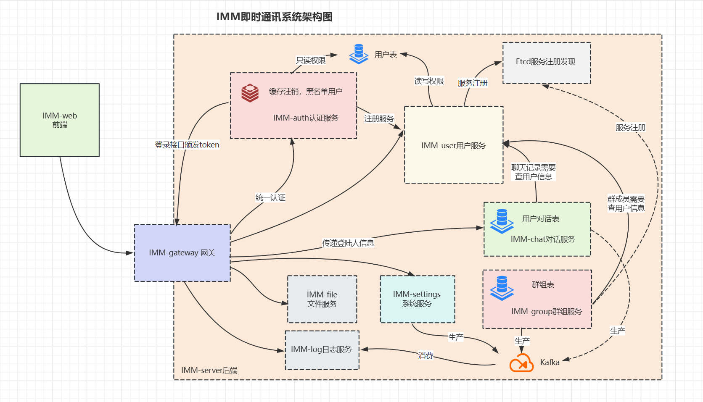

---

# 📡 IMM Server - 即时通信后端服务

**IMM (Instant Messaging Microservices)** 是一个基于微服务架构构建的即时通信系统，具备市面主流 IM 应用的大部分功能，涵盖了中大型项目开发流程、系统设计与微服务架构整合。

---

## 📦 项目模块

IMM 项目由 8 大核心服务构成：

- 🧑‍💼 用户服务（user）
- 💬 对话服务（message）
- 👥 群聊服务（group）
- 🔐 认证服务（auth）
- ⚙️ 系统服务（system）
- 📁 文件服务（file）
- 📝 日志服务（logs）
- 🌐 网关服务（gateway）

---

## ✨ 基本功能

- ✅ **好友管理**：搜索、申请、验证机制
- 💬 **实时聊天**：支持文字、表情、图片、文件、上线提醒
- 🔁 **高级消息功能**：撤回、回复、引用、语音/视频通话
- 👥 **群聊功能**：建群、邀请、权限控制、群禁言、群搜索
- 📌 **会话功能**：好友/群聊置顶、会话列表管理
- 📑 **统一日志服务**：日志聚合与分析
- 🛠 **管理后台视角**：系统使用情况一目了然

---

## 🛠 技术栈

| 技术 | 说明 |
|------|------|
| **[go-zero](https://github.com/zeromicro/go-zero)** | 微服务框架，支持 RPC/HTTP、服务发现等 |
| **GORM** | Golang ORM 框架，处理数据库操作 |
| **MySQL** | 数据存储系统 |
| **Redis** | 高性能缓存、消息订阅等功能 |
| **Kafka** | 消息队列，用于日志服务、消息传递等 |
| **Docker Compose** | 容器编排，简化开发部署流程 |

---

## 📐 系统架构图




---

## 🚀 快速启动

### 1. 下载依赖

在项目根目录下执行：

```bash
go mod tidy
```

### 2. 配置环境

在每个服务的 `etc` 目录中修改对应的配置文件（如 `*.yaml`），配置项包括：

- Etcd 地址
- MySQL 地址
- Redis 地址

### 3. 启动 RPC 服务

以 `user_rpc` 为例：

```bash
cd imm_server/user_rpc
go run userrpc.go
```

确保运行每个服务前，当前目录为服务根目录。

### 4. Kafka 启动（日志服务依赖）

创建网络：

```bash
docker network create app-tier --driver bridge
```

运行 Zookeeper：

```bash
docker run -d --restart=always --name zookeeper-server \
  --network app-tier \
  -e ALLOW_ANONYMOUS_LOGIN=yes bitnami/zookeeper:latest
```

运行 Kafka：

```bash
docker run -d --restart=always --name kafka-server \
  --network app-tier -p 9092:9092 \
  -e ALLOW_PLAINTEXT_LISTENER=yes \
  -e KAFKA_CFG_ZOOKEEPER_CONNECT=zookeeper-server:2181 \
  -e KAFKA_CFG_ADVERTISED_LISTENERS=PLAINTEXT://<你的主机IP>:9092 \
  bitnami/kafka:latest
```

运行 Kafka 管理界面：

```bash
docker run -d --restart=always --name kafka-map \
  --network app-tier -p 9001:8080 \
  -v /opt/kafka-map/data:/usr/local/kafka-map/data \
  -e DEFAULT_USERNAME=admin \
  -e DEFAULT_PASSWORD=admin \
  dushixiang/kafka-map:latest
```

> Kafka Map 登录用户名/密码：`admin / admin`

---

## 📬 联系

如有建议、Bug 反馈或合作意向，请通过 Issues 区或 Pull Request 与我联系。

---

